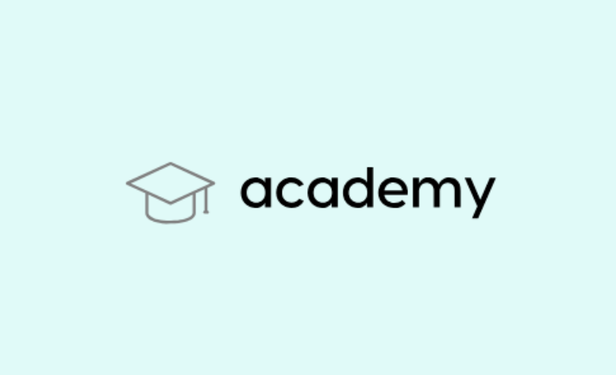

# Projet 1 : Analysez des données de systèmes éducatifs

Dans ce projet, nous avons travaillé pour une StartUp qui propose des formations en ligne et qui souhaite développer son activité à l'international. Pour cela, elle souhaite proposer ses formations dans des pays où le niveau d'éducation est élevé.Pour l'aider dans sa démarche, nous avons analysé les données du systèmes éducatifs, issues  de la Banque Mondiale. Nous avons cherché à comprendre les facteurs qui influencent le niveau d'éducation des pays, et à prédire le niveau d'éducation d'un pays à partir de ces facteurs.

## Contexte

### La StartUp
La StartUp de la EdTech pour laquelle nous avons travaillé s'appelle academy et propose des contenus de formation en ligne pour un public de niveau lycée et université. Elle souhaite développer son activité à l'international, et pour cela, elle souhaite proposer ses formations dans des pays où le niveau d'éducation est élevé. 

Afficher le logo de la StartUp academy à partir du fichier `academy-logo.png`:  

## Jeu de données

Les données utilisées dans ce projet sont issuesde la Banque Mondiale. Elles sont disponibles dans le dossier `data` du projet et accessibles en ligne à l'adresse suivante : https://datacatalog.worldbank.org/dataset/education-statistics. Elles sont regroupées dans des fichiers csv.

La Banque mondiale met à disposition des données sur l’éducation dans le monde. Notamment sur les effectifs, les enseignants, les dépenses, les résultats d’apprentissage, les diplômes, les caractéristiques des établissements d’enseignement, les données d’enquête auprès des ménages, les projections, etc. Ces données sont issues de sources officielles nationales, de rapports de pays préparés par les équipes de la Banque mondiale et d’estimations de la Banque mondiale.

Les requête sur indicateurs statistiques lié à l'éducation de la Banque mondiale contient plus de 4 000 indicateurs comparables au niveau international qui décrivent l'accès à l'éducation, la progression, l'achèvement, l'alphabétisation, les enseignants, la population et les dépenses. Ces indicateurs couvrent le cycle d'enseignement, du préprimaire à l'enseignement professionnel et supérieur.

**Autres Sources** : 
- https://www.kaggle.com/theworldbank/education-statistics
- https://www.kaggle.com/theworldbank/world-bank-intl-education

## Objectifs

### Objectif 1 : Comprendre les facteurs qui influencent le niveau d'éducation des pays

Pour répondre à cet objectif, nous avons cherché à comprendre les facteurs qui influencent le niveau d'éducation des pays. Pour cela, nous avons cherché à répondre aux questions suivantes :
- Quels sont les pays qui ont le plus haut niveau d'éducation ?
- Quels sont les pays qui ont le plus faible niveau d'éducation ?
- Quels sont les facteurs qui influencent le niveau d'éducation des pays ?

### Objectif 2 : Prédire le niveau d'éducation d'un pays à partir de ces facteurs

Pour répondre à cet objectif, nous avons cherché à prédire le niveau d'éducation d'un pays à partir de ces facteurs. Pour cela, nous avons cherché à répondre aux questions suivantes :
- Quels sont les facteurs qui influencent le niveau d'éducation des pays ?
- Quels sont les facteurs qui influencent le niveau d'éducation des pays ?

### Objectif 3 : Prédire les pays avec un fort potentiel de développement pour la StartUp

Pour répondre à cet objectif, nous avons cherché à prédire les pays avec un fort potentiel de développement pour la StartUp. Pour cela, nous avons cherché à répondre aux questions suivantes :
- Quels sont les pays avec un fort potentiel de clients pour la formation en ligne ?
- Quels sont les pays avec un fort potentiel de développement pour la StartUp ?
- Pour chacun de ces pays, quelle sera l’évolution de ce potentiel de clients ?
- Dans quels pays l'entreprise doit-elle opérer en priorité ?

## Méthodologie

Pour répondre à ces objectifs, nous avons suivi la méthodologie suivante :
- Nettoyage des données 
- Analyse exploratoire des données
- Modélisation des données 
- Analyse des résultats obtenus
- Rédaction du rapport d'analyse et de recommandations pour la StartUp academy 
- Présentation Powerpoint à la StartUp academy pour son développement à l'international

## Livrables

Les livrables de ce projet sont les suivants :
- Un notebook `P1_01_notebook_nettoyage.ipynb` qui contient le nettoyage des données
- Un notebook `P1_02_notebook_exploratoire.ipynb` qui contient l'analyse exploratoire des données 

## Environnement de développement

Pour travailler sur ce projet, nous avons utilisé un environnement de développement basé sur un environnement conda. Pour installer cet environnement, il faut exécuter la commande suivante dans un terminal :
`conda env create -f environment.yml`

Pour activer l'environnement, il faut exécuter la commande suivante dans un terminal :
`conda activate projet1`

Pour lancer un notebook jupyter, il faut exécuter la commande suivante dans un terminal :
`jupyter notebook`

## Auteur

Ce projet a été réalisé par [Thomas AWOUNFOUET](https://www.linkedin.com/in/thomas-awounfouet-83732186/), dans le cadre de la formation [Data Scientist](https://openclassrooms.com/fr/paths/793-data-scientist) de [OpenClassrooms](https://openclassrooms.com/).

